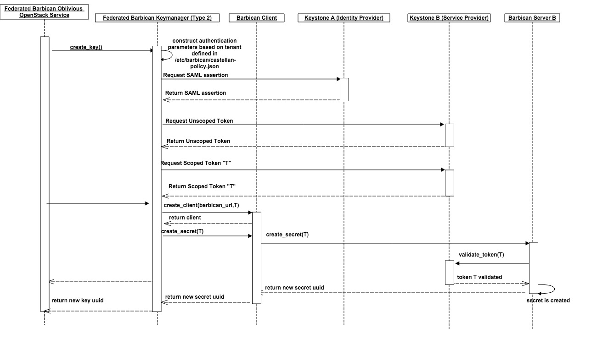

========================================
Federated Castellan Barbican Key Manager
========================================

Overview
========
* The goal of the Federated Castellan Barbican Key Manager is to change existing code
  as least as possible. The barbican client would be changed to be flexible
  enough to be able to connect to any barbican instance if the barbican host url and 
  authentication parameters are provided. A new federated barbican key manager would then create
  instances of the flexible barbican clientto connect to a specific barbican host.
  There are two high level architecture designs.

Establishing trust
==================
* Keystone to Keystone federation will be used. There will be a Identity Provider
  Keystone and a Service Provider Keystone. 

Federation of secrets
=====================
* A federated version of the barbican key manager in Castellan 
  will be in charge of forwarding the request to the right barbican. 

Federated Barbican Aware Services vs Federated Barbican Oblivious Services
==========================================================================================
* Federated Barbican Aware Services (which do not currently exist) are OpenStack services that have
  control over where to store a barbican secret. The federated key manager's APIs
  would provide parameters that include a link to the specific barbian 
  host and a scoped token.

* Federated Barbican Oblivious Services are OpenStack services that do not know that
  federated barbican is being used under the hood. The APIs that they call
  match the current libarary APIs for the Castellan Barbican Key Manager (So they don't
  have to call the APIs differently). A mapping between project-id to a barbican host is
  required to automate the request flow and for keystone to keystone federation.

Type 1: Federated Barbican Aware Services
=================================================
* The APIs for the federated barbican keymanager will expand on the current Barbican KeyManager 
  to include target host (keyhost_url) and a scoped token (host_auth).

* example api extended:

  .. code-block:: python

    create_key(self, context, algorithm, length, keyhost_url, host_auth, expiration=None, name=None)
    create_key_pair(self, context, algorithm, length, keyhost_url, host_auth, expiration=None, name=None)
    store(self, context, managed_object, keyhost_url, host_auth, expiration=None)
    get(self, context, managed_object_id, keyhost_url, host_auth)
    delete(self, context, managed_object_id, keyhost_url, host_auth)

*  This implies that the service that uses the federated castellan library will need to keep
   track of which barbican host has the key and provide the scoped token to authenticate to it.

*  Once provided with the federated parameters, a barbican client instance will be created
   to connect to the given barbican.

Type 2: Federated Barbican Oblivious Services
=====================================================
*  The APIs for the current Barbican KeyManager will not be changed. Automation of directing
   key operations to barbican hosts will be built around policies that define mappings for
   tenants to barbican hosts. A new module for automating federation will be created. 
   When a scoped token is provided from a user, it will be used to create SAML assertions
   across the two given keystones (one identity provider and one service provider). An
   unscoped token will be returned and a scoped token to access a particular barbican 
   host will be returned. A new barbican client will then be created with the barbican host
   and token. This mapping for tenants to barbican hosts will be defined in
   a new file called /etc/barbican/castellan-policy.json. 

* castellan-policy.json example: 

  .. code-block:: JSON
  
    {   
       "tenant-name or tenant-id":
       { 
            "keystone-identity-provider": "{keystone-identity-provider-info}",
            "keystone-service-provider": "{keystone-service-provider-info}",
            "barbican_host": "{barbican-host-info}"
       }
    }

